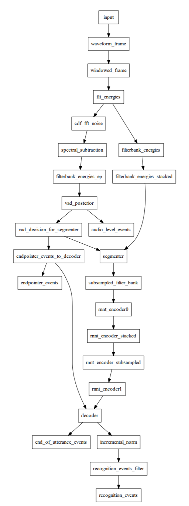

## Overview
This project aims to research google's offline speech recognition, from several android apps and ideally make them interoperable by replicating it on any system that supports tensorflow.  
The research was performed on Bluestacks using the x86_64 version of libgoogle_speech_jni.so and frida/ghidra/ida as the analysis tools.  
A sample android app that loads the native library and performs inference on a sample wav file can be found [here](./android)

Notes: This analysis was performed using the library from google quick search box version 11.7.11.21 (x86_64)
  
## Analysis

There are only two main components on any of the apps that offer offline speech recognition:
### Native library
A C++ native library that does the heavy lifting.  
This library is mostly a bundle of several other libraries such as tensorflow-lite, openfst, etc.  
It reads and parses the dictation.config file and other model components and builds a pipeline that is then used to perform the speech recognition.  
The library may have different names depending on the apps. In GBoard is called libintegrated_shared_jni.so but in google quick search box is called libgoogle_speech_jni.so.  
The newer versions of the library are backwards compatible with other models as they work with both the 2018 and 2019 models. They also seems to be compatible with other language models.

#### Protobuf messages
By searching the native library for base64 strings the encoded protobuf messages can be found.  
Using something like [pbtk](https://github.com/marin-m/pbtk) these protobuf messages can be fully extracted and using `protoc` the python interfaces can be generated.  
After having the interfaces for the messages the dictation.config file can be completely parsed and potentially modified in order to perform further analysis (eg: remove layers from the pipeline in order to get intermediate data, or enable logging)  
More under [analysis/protobuf](./analysis/protobuf)

#### Bundled libs
Since the native library includes many well know open source libraries the assembly can be more or less easily understood.  
A set of frida scripts is provided [here](./frida) that will dump all the tflite nodes and input and output tensors when `Invoke` is called. This facilitates debugging by comparing the outputs from the library against running the models locally.

### Models and transducers
A set of tensorflow-lite models, configs and FST files that the app downloads when offline speech recognition is enabled (Fast-Typing in GBoard)

#### Tensorflow-lite models
In respect to the actual tensorflow-lite models it seems that the network is composed of 5 models (dec, enc0, enc1, ep and joint) and is based on [this paper](https://www.isca-speech.org/archive/Interspeech_2017/pdfs/0233.PDF) published by google.  
In the 2018 model they are obfuscated using bitwise xor as seen in the decoded config file.

#### MFAR
There are several files inside the model folder with the `.mfar` extension.  
These files seem to contain OpenFST transducers that transform the data in different steps of the pipeline. The files seem to be decoded into [mmap](http://man7.org/linux/man-pages/man2/mmap.2.html) in order to be mapped into memory.  

#### Other
The model contains other files that are potentially used, such as `input_mean_stddev`  
These still need to be analysed in order to understand their meaning and contents.

## Credits
- [@theafien](https://github.com/theafien) - Built the android app that loads the library and runs the model.
- [@biemster](https://github.com/biemster) - Researched the same subject and kicked off this project.

## References
- [https://hackaday.io/project/164399-android-offline-speech-recognition-natively-on-pc]()